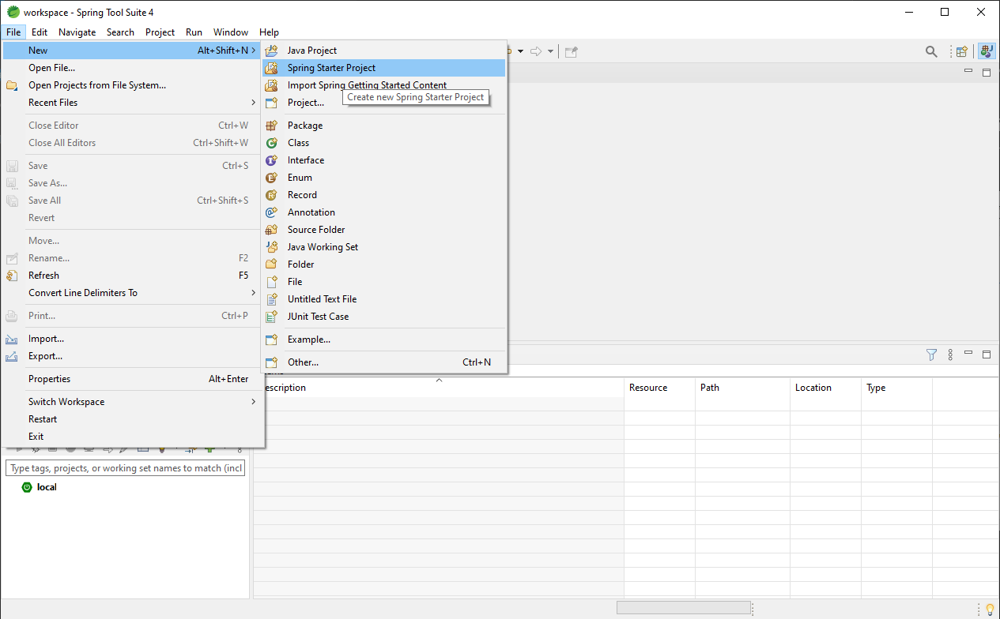
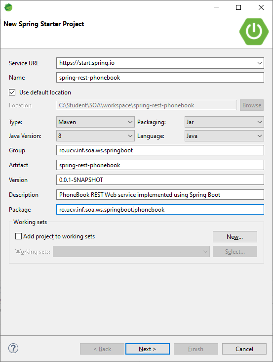
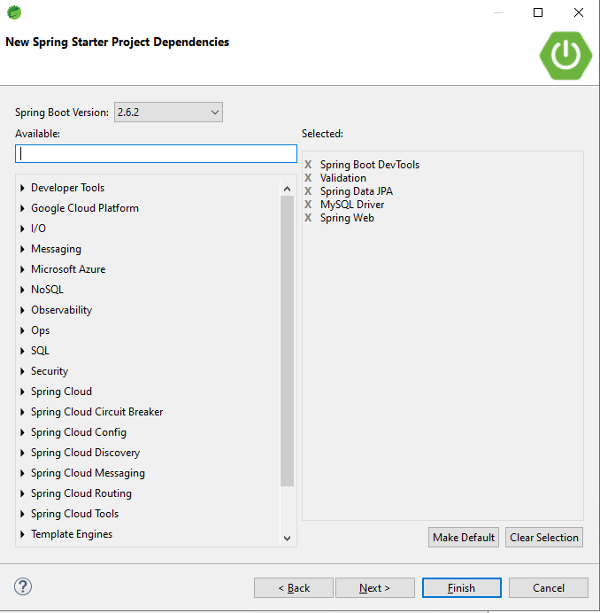
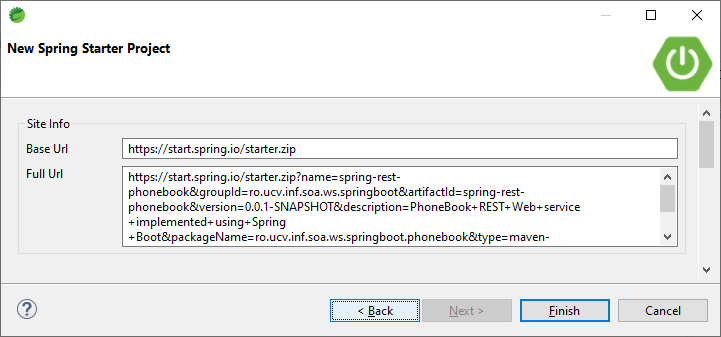
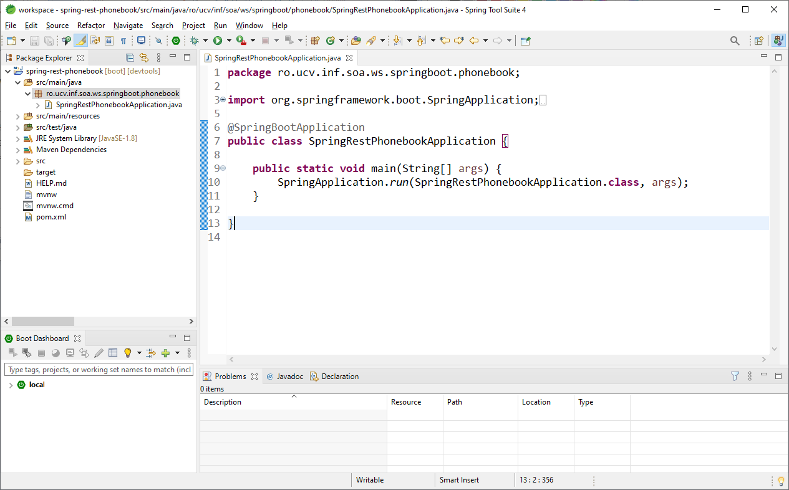

Implementing RESTful Web Services using Java Spring Framework
=============================================================

This folder contains examples of REST Web Services implemented using Java Spring Framework:

* [_PhoneBook_ REST Web Service](spring-rest-phonebook)

Creating a Spring Boot Application in STS
-----------------------------------------
Steps to create a Spring Boot Application in Spring Tool Suite are:

* From _File_ menu select _New -> Spring Starter Project_

* Select _Maven_ project type,  and fill the maven project details (_Name_, _Group_, _Artifact_, _Description_, _Package_)

* Add project dependencies and click "Next"

* Finalize the project
 
* Start Editing Project
 
