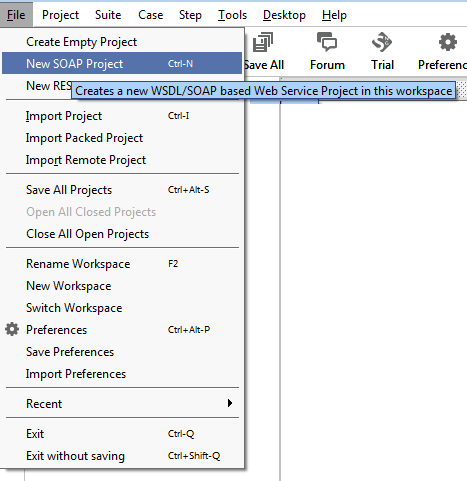
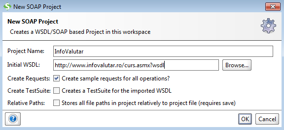
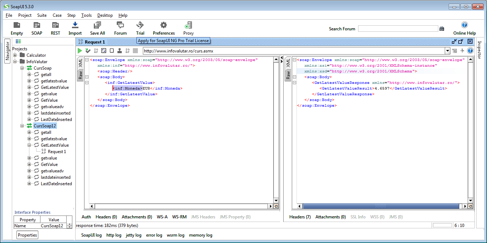

InfoValutar - SOAP Web Service Client
==============================

This example shows how can be implemented a Web Service Client in PHP language.

The client connects to a Web Service that provide currency information from National Bank of Romania.
  


InfoValutar - Web Service
-------------------------
_[InfoValutar](http://www.infovalutar.ro/)_ is a free Web Service that provide currency exchange rates from National Bank of Romania.  
The WSDL file describing the web service is available at this URL [http://www.infovalutar.ro/curs.asmx?wsdl](http://www.infovalutar.ro/curs.asmx?wsdl).
This provide de following methods (operations):

* `GetLatestValue` - provides the latest exchange rate for a specified currency.
* `GetValue` - provides the exchange rate for a specified currency from a date.
* `getall` - provides the latest exchange rates for all currencies.
* `LastDateInserted` - provides the last date when a exchange rates was updated. 

A simplified version of WSDL file of InfoValutar web service containing only `GetLatestValue` related entries: 
``` xml
<?xml version="1.0" encoding="UTF-8"?>
<wsdl:definitions xmlns:s="http://www.w3.org/2001/XMLSchema"
  xmlns:soap12="http://schemas.xmlsoap.org/wsdl/soap12/"
  xmlns:mime="http://schemas.xmlsoap.org/wsdl/mime/" xmlns:tns="http://www.infovalutar.ro/"
  xmlns:soap="http://schemas.xmlsoap.org/wsdl/soap/"
  xmlns:tm="http://microsoft.com/wsdl/mime/textMatching/"
  xmlns:http="http://schemas.xmlsoap.org/wsdl/http/"
  xmlns:soapenc="http://schemas.xmlsoap.org/soap/encoding/"
  targetNamespace="http://www.infovalutar.ro/" xmlns:wsdl="http://schemas.xmlsoap.org/wsdl/">
  <wsdl:types>
    <s:schema elementFormDefault="qualified" targetNamespace="http://www.infovalutar.ro/">
      <s:element name="GetLatestValue">
        <s:complexType>
          <s:sequence>
            <s:element minOccurs="0" maxOccurs="1" name="Moneda" type="s:string"/>
          </s:sequence>
        </s:complexType>
      </s:element>
      <s:element name="GetLatestValueResponse">
        <s:complexType>
          <s:sequence>
            <s:element minOccurs="1" maxOccurs="1" name="GetLatestValueResult"
              type="s:double"/>
          </s:sequence>
        </s:complexType>
      </s:element>

    </s:schema>
  </wsdl:types>
  <wsdl:message name="GetLatestValueSoapIn">
    <wsdl:part name="parameters" element="tns:GetLatestValue"/>
  </wsdl:message>
  <wsdl:message name="GetLatestValueSoapOut">
    <wsdl:part name="parameters" element="tns:GetLatestValueResponse"/>
  </wsdl:message>

  <wsdl:portType name="CursSoap">
    <wsdl:operation name="GetLatestValue">
      <wsdl:input message="tns:GetLatestValueSoapIn"/>
      <wsdl:output message="tns:GetLatestValueSoapOut"/>
    </wsdl:operation>
  </wsdl:portType>
  <wsdl:binding name="CursSoap" type="tns:CursSoap">
    <soap:binding transport="http://schemas.xmlsoap.org/soap/http"/>
    <wsdl:operation name="GetLatestValue">
      <soap:operation soapAction="http://www.infovalutar.ro/GetLatestValue" style="document"/>
      <wsdl:input>
        <soap:body use="literal"/>
      </wsdl:input>
      <wsdl:output>
        <soap:body use="literal"/>
      </wsdl:output>
    </wsdl:operation>
  </wsdl:binding>
  <wsdl:binding name="CursSoap12" type="tns:CursSoap">
    <soap12:binding transport="http://schemas.xmlsoap.org/soap/http"/>
    <wsdl:operation name="GetLatestValue">
      <soap12:operation soapAction="http://www.infovalutar.ro/GetLatestValue" style="document"/>
      <wsdl:input>
        <soap12:body use="literal"/>
      </wsdl:input>
      <wsdl:output>
        <soap12:body use="literal"/>
      </wsdl:output>
    </wsdl:operation>
  </wsdl:binding>
  <wsdl:service name="Curs">
    <wsdl:port name="CursSoap" binding="tns:CursSoap">
      <soap:address location="http://www.infovalutar.ro/curs.asmx"/>
    </wsdl:port>
    <wsdl:port name="CursSoap12" binding="tns:CursSoap12">
      <soap12:address location="http://www.infovalutar.ro/curs.asmx"/>
    </wsdl:port>
  </wsdl:service>
</wsdl:definitions>
```
In order to analyze the operations implemented by InfoValutar Web Service you can use one of the following tools:

* [SoapUI](https://www.soapui.org/)
* [Oxygen XML Editor](https://www.oxygenxml.com/)

### Using SoapUI to test Web Service ###
In the following is presented how can use SoapUI to perform requests to a web service.

1) In the main panel of SoapUI GUI click on the _Project_ menu and select _New SOAP Project_:


2) Enter the _Project Name_ and the WSDL URL in _Initial WSDL_ field:


3) In the tree structure at the left in the SoapUI GUI select _InfoValutar -> CursSoap12 -> GetLatestValue -> Request 1_ enter the `EUR` in `<inf:Moneda>` tag and click on the top green button to send reuquest on the server. 

 
Implementing the Web Service Client in PHP
------------------------------------------
The following code show how can inkove `GetLatestValue` web service operation in order to obtain the exchange rate for a specified currency:

```php
<html>
<head>
  <title>InfoValutar Web Service Client</title>
</head>
<body>
<?php

$moneda = isset($_REQUEST['moneda']) ? $_REQUEST['moneda'] : "";

echo "<h2>BNR - Exchange rates</h2>";
echo "<form action='index.php' method='GET'>";
echo "Currency: <input name='moneda' value='$moneda'/> e.g. EUR, USD, GBP<br/>";
echo "<input type='submit' name='submit' value='Submit'/>";
echo "</form>";

if($moneda != ''){
  $client = new SoapClient('http://www.infovalutar.ro/curs.asmx?wsdl',
              array( 'exceptions' => 1,'trace' => TRUE));
  try {
    
    $result = $client-> GetLatestValue(array('Moneda' => $moneda));
    
    echo "The exchange rate for 1 $moneda is " . $result->GetLatestValueResult ." RON <br/>";
    echo  "<hr/>";
    echo "<h3>REQUEST:</h3>" ; 
    echo "<textarea rows='10' cols='100'>";
    echo  htmlentities(str_ireplace('><', ">\n<", $client->__getLastRequest()));
    echo "</textarea>";
    echo "<h3>RESPONSE:</h3>";
    echo "<textarea rows='10' cols='100'>";
    echo htmlentities(str_ireplace('><', ">\n<", $client->__getLastResponse()));
    echo "</textarea>";  
  } catch (SoapFault $e) {
    echo "Error:" . $e->faultstring; 
  }  
}
?>
</body>
</html>
```


Running Example
---------------
In this section is presented how to deploy the code in [XAMPP for Windows 7.2.0] (https://sourceforge.net/projects/xampp/files/XAMPP%20Windows/7.2.0/xampp-win32-7.2.0-0-VC15.zip/download) which contains PHP 7.

First, we must enable _PHP SOAP extension_ because this is not enabled by default. Open `xampp\php\php.ini` file, locate the following line:

``` ini
;extension=soap
```
and remove semi-column `;`  

``` ini
extension=soap
```
Save file and restart the _Apache Web Server_.

Next, copy the `curs-valutar` folder in `xampp\htdocs\curs-valutar` 

Now, in the Web Browser open [http://localhost/curs-valutar](http://localhost/curs-valutar).


